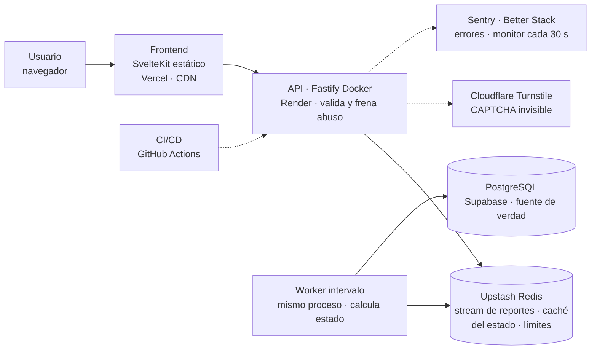

# Monitor de caídas bancarias

Dónde se rompe un pago entre bancos en Venezuela, a partir de reportes de usuarios.

Propuesta de proyecto integrador · Computación en la Nube · UCAB · Octubre 2026

> Este archivo es la propuesta tal como la acordó el equipo. No se edita: los cambios posteriores
> quedan en [decisiones](decisiones.md) y los requisitos que salen de aquí (`R#`) viven en
> [requisitos](requisitos.md). Cambio conocido: las alertas por Telegram de la sección 9 salieron
> del proyecto (D11).

## 1. Resumen

Se propone una aplicación web que muestra, en tiempo real, en qué tramo se está rompiendo un pago
entre bancos en Venezuela: el banco de origen, el de destino o el sistema que los conecta. La
información sale de reportes de los propios usuarios.

El pico de tráfico de la aplicación ocurre justo cuando los bancos fallan. Por eso la arquitectura
cloud no es un accesorio: es el producto. El usuario principal es el comercio que tiene que decidir
si entrega la mercancía.

## 2. Problema

Las fallas bancarias en Venezuela son frecuentes y se concentran en los días de pago. La gente se
entera por X, no por el banco. El 15-05-2026 fallaron a la vez Banesco, Mercantil, BDV, Provincial y
Banco Plaza en plena quincena. Banco Plaza atribuyó la falla a la Cámara de Compensación Electrónica
(CCE) del BCV.

| Fecha            | Banco                                      | Qué pasó                                                                         | Fuente           |
| ---------------- | ------------------------------------------ | -------------------------------------------------------------------------------- | ---------------- |
| 25 al 28-05-2026 | Banco Digital de los Trabajadores          | Más de 80 horas caído, desde el día del depósito de la quincena y el cestaticket | Bloomberg Línea  |
| 15-05-2026       | Banesco, Mercantil, BDV, Provincial, Plaza | Transferencias retenidas en quincena; causa en la CCE del BCV                    | El Diario        |
| 05-06-2026       | BDV                                        | Falla en la mañana, sin causa informada                                          | Bloomberg Línea  |
| 01-12-2025       | Mercantil                                  | Fallas de plataforma                                                             | El Diario        |
| 17-10-2025       | Mercantil                                  | Falla                                                                            | Finanzas Digital |
| 01-06-2025       | BDV                                        | Fallas reportadas por usuarios                                                   | El Diario        |

Tamaño del público (por verificar): más de 20 millones de personas afiliadas a pago móvil y unas
7.000 operaciones por minuto en 2026. En enero de 2026 el pago móvil pasó a ser el método de pago
más usado.

### Cómo se entera la gente hoy

No se encontró ningún servicio dedicado a fallas de bancos venezolanos.

| Alternativa                     | Qué cubre                             | Por qué no resuelve el problema                                 |
| ------------------------------- | ------------------------------------- | --------------------------------------------------------------- |
| X y notas de prensa             | Quejas sueltas de usuarios            | Hay que buscar y leer; la nota llega horas después              |
| Canales oficiales de los bancos | Avisos en redes                       | Llegan tarde o nunca                                            |
| GeoBlackout                     | Cortes de luz e internet en Venezuela | No cubre bancos ni pago móvil                                   |
| Downdetector                    | Servicios globales                    | No se encontraron páginas de bancos venezolanos (por verificar) |

## 3. Propuesta y MVP

El MVP (producto mínimo viable) responde una pregunta en menos de 5 segundos: ¿dónde se rompe este
pago y qué hago ahora? Cuando la app del banco no abre, la falla se ve sola. Las fallas que no se ven
son otras: el pago sale y no llega, el banco propio funciona pero el de destino no, o la falla está
en la CCE del BCV. Desde la app del banco eso no se distingue.

### Usuarios

- **Comercio (usuario principal):** un cliente muestra "operación exitosa" y el dinero no llega.
  Debe decidir si entrega la mercancía, espera o pide otro método de pago.
- **Quien paga:** el pago salió de su cuenta y no llegó. Quiere saber si reintenta, espera o paga
  desde otro banco.

### Fuera del MVP

- Cuentas de usuario y comentarios.
- Aplicación móvil nativa.
- Sondeo automático de los servidores de los bancos (propuesta pendiente, ver sección 10).

### Funciones del MVP

- **Estado por par de bancos.** Para cada combinación origen → destino: normal, posibles problemas o
  muchos reportes. Se comparan los reportes de los últimos 15 minutos con lo habitual a esa hora.
  Con 10 bancos son 100 pares, y el worker los calcula todos en una sola pasada.
- **Reportar en un toque.** Banco de origen, banco de destino y qué pasó: no sale, sale y no llega,
  error en la app o punto de venta. Sin cuenta de usuario. Máximo un reporte por dispositivo, par de
  bancos y ventana de 15 minutos.
- **Detalle por banco.** Reportes de las últimas 24 horas como origen y como destino, y los pares
  más afectados.

**Cómo se decide que hay un problema.** Se sigue la idea de Downdetector: comparar los reportes de
ahora con una línea base, el promedio para esa hora del día. Solo se marca un problema si los
reportes quedan muy por encima de esa línea. Se cuenta un solo reporte por usuario y par de bancos.
La línea base es más corta que la de Downdetector, porque el sistema empieza sin historial.

**Riesgo legal.** En 2010 se acusó a dos usuarios de Twitter de difundir información falsa sobre la
banca, con base en la Ley General de Bancos de 2001. Por eso la aplicación nunca dice "el banco está
caído". Dice "N personas reportan problemas con pago móvil de Banco X en los últimos 15 minutos".

## 4. Arquitectura

Un monolito con un worker, sin Kubernetes ni microservicios. El enunciado no da puntos por ellos, y
así todo el equipo puede defender cada pieza.

Figura 1. Diagrama inicial. Turnstile, Sentry y Better Stack son servicios externos. La flecha
punteada desde CI/CD es el despliegue, no tráfico de usuarios.

La API frena el abuso y pasa cada reporte a un stream de Redis sin tocar PostgreSQL. La razón es
concreta: el plan gratuito de Supabase solo acepta 15 conexiones a la vez. El worker guarda los
reportes por lotes y publica el estado de cada par de bancos. Si Redis cae, la API escribe directo
en PostgreSQL (ver sección 7).

| Pieza       | Elegido                                              | Por qué                                                                                                                                        | Descartado                                                                          |
| ----------- | ---------------------------------------------------- | ---------------------------------------------------------------------------------------------------------------------------------------------- | ----------------------------------------------------------------------------------- |
| Frontend    | SvelteKit estático (adapter-static) en Vercel        | Archivos fijos servidos por CDN (red de distribución de contenido): absorben el pico sin ejecutar código, y la API queda como el único backend | SvelteKit con servidor: dos backends que defender                                   |
| Backend     | Fastify (TypeScript) en Docker                       | Mismo lenguaje que el frontend, liviano para los 512 MB del plan gratuito, validación con JSON Schema                                          | NestJS: su estructura sobra para 5 endpoints. Go: aprenderlo choca con el Parcial 1 |
| Worker      | Intervalo dentro del proceso de la API               | Cabe en el único servicio gratuito de Render                                                                                                   | Servicio aparte: no tiene plan gratuito                                             |
| Datos       | PostgreSQL en Supabase y Redis en Upstash            | Administrados y gratuitos                                                                                                                      | —                                                                                   |
| Repositorio | Público en GitHub                                    | GitHub Actions gratis                                                                                                                          | Privado                                                                             |
| Costo       | $0, con Azure for Students como respaldo sin tarjeta | Ningún integrante paga                                                                                                                         | Render Starter ($7/mes); créditos de AWS (piden tarjeta internacional)              |

### Qué tiene estado

PostgreSQL es la fuente de verdad: bancos, reportes y totales por hora. Redis guarda estado temporal
(contadores, llaves de deduplicación y caché del estado) que se puede reconstruir desde PostgreSQL.
La API y el worker no guardan estado.

## 5. Requisitos del enunciado

Cada requisito obligatorio sale del propio dominio, sin piezas agregadas solo para cumplir.

| Requisito                                                            | Cómo lo cumple el monitor                                                                       | Corte |
| -------------------------------------------------------------------- | ----------------------------------------------------------------------------------------------- | ----- |
| Repositorio con historial real, README, `.gitignore`, `.env.example` | Repositorio creado al inicio; cada integrante hace commits de su pieza desde el principio       | 1.º   |
| URL pública                                                          | Frontend y API desplegados desde el primer corte                                                | 1.º   |
| Diagrama de arquitectura                                             | Figura 1                                                                                        | 1.º   |
| Al menos un contenedor                                               | La API de Fastify corre en Docker, con el worker dentro del mismo proceso                       | 1.º   |
| Base de datos administrada                                           | PostgreSQL administrado guarda reportes y totales por hora                                      | 1.º   |
| Secretos fuera del código                                            | Variables de entorno de cada plataforma; solo `.env.example` en el repositorio                  | 1.º   |
| Caché o justificar no usarla                                         | El estado de cada par de bancos vive en Redis con 30 s de vida: miles leen, pocos reportan      | 2.º   |
| CI/CD                                                                | GitHub Actions: pruebas y build en cada PR; despliegue automático al fusionar en `main`         | 2.º   |
| Logs y monitoreo                                                     | Logs estructurados, errores capturados y un panel con reportes por minuto y latencia            | 2.º   |
| Seguridad mínima                                                     | Límite de reportes por dispositivo e IP, CAPTCHA invisible, HTTPS                               | 2.º   |
| Análisis de escalabilidad                                            | Prueba de carga que simula una quincena con un banco caído                                      | 2.º   |
| IaC (bonificación)                                                   | Terraform para las plataformas que tienen proveedor oficial (Render, Supabase, Upstash, Vercel) | Final |

## 6. Calidad del código

Se usan solo controles pequeños que cada integrante puede explicar. Cada control debe poder fallar:
uno que siempre pasa no prueba nada.

| Control                                                                          | Qué atrapa                                                                         | Corte |
| -------------------------------------------------------------------------------- | ---------------------------------------------------------------------------------- | ----- |
| commitlint + Husky                                                               | Mensajes de commit fuera de Conventional Commits                                   | 1.º   |
| lint-staged con ESLint y Prettier                                                | Estilo roto antes de llegar al PR                                                  | 1.º   |
| CI: instalar con lockfile, lint, typecheck, pruebas y build de Docker            | Código que no compila, pruebas rotas o un Dockerfile roto antes de llegar a Render | 1.º   |
| gitleaks en el CI                                                                | Secretos subidos por error al repositorio público                                  | 1.º   |
| Protección de `main`: PR obligatorio y CI en verde                               | Cambios que se saltan la revisión                                                  | 1.º   |
| Identidad de Git por integrante y `git shortlog -sn` antes de cada corte         | Un historial que no muestra el aporte de todos                                     | 1.º   |
| Vitest en API y frontend, sin permitir cero pruebas                              | Una suite que "pasa" sin ejecutar nada                                             | 2.º   |
| Prueba del `/health` después de cada despliegue                                  | Un despliegue en verde que no responde                                             | 2.º   |
| `pnpm audit` y Dependabot mensual                                                | Dependencias con vulnerabilidades altas                                            | 2.º   |
| Complejidad máxima 10 por función y cobertura del código nuevo al 80 % (Codecov) | Funciones difíciles de probar y código nuevo sin pruebas                           | 2.º   |

## 7. Fallos y escalabilidad

Una aplicación de fallas no puede caerse justo cuando todo falla. Cada pieza tiene un plan si se
cae, y ningún reporte se pierde.

| Si se cae…                         | Qué hace la aplicación                                                                                                                             |
| ---------------------------------- | -------------------------------------------------------------------------------------------------------------------------------------------------- |
| PostgreSQL                         | Los reportes siguen entrando al stream de Redis. El estado se sigue sirviendo desde Redis. Aviso: "historial no disponible por ahora".             |
| Redis                              | Modo degradado: la API escribe directo en PostgreSQL con un límite por IP más estricto, y guarda el estado 30 s en memoria.                        |
| El worker                          | El estado deja de actualizarse. La pantalla muestra "actualizado a las 9:42" y se pone naranja a los 3 minutos. Los reportes esperan en el stream. |
| Una avalancha de reportes o un bot | Límite por dispositivo e IP, un reporte por persona, par de bancos y 15 minutos, CAPTCHA para IPs sospechosas y respuesta 429.                     |
| El CAPTCHA externo                 | Deja pasar con un límite más bajo y lo registra como error.                                                                                        |

Cuellos de botella, en orden: la CPU del plan gratuito de Render (una sola instancia), el pool de
15 conexiones de Supabase, la cuota de comandos de Upstash y los 5 GB de ancho de banda de Render.

### Plan ante 100 veces más tráfico

- Las lecturas, que son la mayoría, se sirven desde la caché del CDN con 30 s de vida. La API casi
  no las ve.
- Los reportes entran a Redis, no a PostgreSQL. El worker los guarda por lotes.
- La API no guarda estado, así que se agregan instancias.
- La tabla de reportes se parte por mes, y los reportes crudos se borran a los 30 días.

**Demostración: una quincena simulada.** Una prueba de carga con k6 (gratuita y local) lleva el
tráfico de 5 a 500 lecturas y 50 reportes por segundo en 10 minutos, con un banco caído. Durante la
prueba se muestran la latencia p95, la tasa de errores y de respuestas 429, los aciertos de caché,
el atraso del worker y el uso del pool de conexiones. Esta misma simulación es la demo de la
defensa: sin usuarios reales, es la forma de ver el estado cambiar.

## 8. Plataformas y costos

Todo el proyecto puede costar $0. La API y el worker corren en un solo servicio gratuito de Render.
Un monitor lo consulta cada 30 s para que no se duerma, y así usa unas 744 de las 750 horas gratis
del mes. El costo de esa decisión es que no cabe un segundo servicio gratuito. Respaldo sin tarjeta:
Azure for Students da $100 por estudiante (falta verificar que acepte el correo de la UCAB).

| Pieza                   | Plataforma            | Modelo | Límite del plan gratuito que importa                                                  | Costo                              |
| ----------------------- | --------------------- | ------ | ------------------------------------------------------------------------------------- | ---------------------------------- |
| Frontend                | Vercel Hobby          | PaaS   | 100 GB de ancho de banda; solo uso no comercial                                       | $0                                 |
| API (Docker)            | Render                | PaaS   | Se duerme tras 15 min sin tráfico y tarda ~1 min en despertar; 5 GB de ancho de banda | $0 con monitor                     |
| Worker                  | Render                | PaaS   | Los workers y cron no tienen plan gratuito                                            | $0: intervalo dentro de la API     |
| Base de datos           | Supabase              | DBaaS  | 500 MB; pool de 15 conexiones; se pausa tras 7 días sin uso                           | $0                                 |
| Caché, límites y stream | Upstash Redis         | DBaaS  | 500.000 comandos al mes: una prueba de carga los agota                                | $0, cuidando la cuota en la prueba |
| CAPTCHA                 | Cloudflare Turnstile  | SaaS   | 1 millón de verificaciones al mes                                                     | $0                                 |
| Errores y monitoreo     | Sentry y Better Stack | SaaS   | 5.000 errores al mes; 10 monitores cada 30 s y una página de estado                   | $0                                 |
| CI/CD                   | GitHub Actions        | SaaS   | Gratis en repositorios públicos                                                       | $0                                 |

PaaS: plataforma como servicio. DBaaS: base de datos como servicio. SaaS: software como servicio.

## 9. Roles y plan hasta el primer corte

Cada integrante es dueño de una pieza y la defiende de punta a punta. El 40 % individual exige que
todos expliquen también el flujo completo.

| Pieza                  | Qué defiende                                                                       |
| ---------------------- | ---------------------------------------------------------------------------------- |
| Frontend               | Pantallas de estado, reporte y detalle; carga rápida en un teléfono con mala señal |
| API e ingesta          | Recibir reportes, validar, frenar el abuso, contrato de la API                     |
| Worker y detección     | Ventanas de tiempo, línea base por hora y el umbral que decide "problema"          |
| Datos y caché          | Esquema en PostgreSQL, Redis, qué tiene estado y qué pasa si cae cada uno          |
| Plataforma y operación | Docker, CI/CD, secretos, monitoreo, prueba de carga e IaC                          |

El corte del 28–30 de octubre coincide con el Parcial 1. Por eso el despliegue público va en la
semana 3, no el último día.

| Semana        | Trabajo                                                                                                                                                                            |
| ------------- | ---------------------------------------------------------------------------------------------------------------------------------------------------------------------------------- |
| 1 (5–11 oct)  | Aprobar la propuesta. Crear el repositorio con README, `.gitignore` y `.env.example`. Crear las cuentas en las plataformas. Definir el esquema de datos y bocetar las 3 pantallas. |
| 2 (12–18 oct) | API que recibe reportes y calcula el estado con un conteo simple de 15 minutos. Frontend conectado. Dockerfile. Base de datos administrada creada.                                 |
| 3 (19–25 oct) | Primer despliegue público, diagrama inicial, modelo de servicio de cada pieza y datos de prueba para la demo.                                                                      |
| 26–27 oct     | Ensayo del corte: cada integrante explica su pieza y el flujo completo.                                                                                                            |

Para el segundo corte: caché en Redis, cola con worker, alertas por Telegram, CI/CD completo,
monitoreo y la prueba de carga.

## 10. Riesgos y preguntas abiertas

| Riesgo                                                                      | Plan                                                                                                       |
| --------------------------------------------------------------------------- | ---------------------------------------------------------------------------------------------------------- |
| Sin usuarios reales, el estado nunca cambia en la demo                      | Datos sembrados y la prueba de carga como evidencia; la demo es la quincena simulada                       |
| Reportes falsos que "tumban" un banco                                       | Un reporte por persona, par de bancos y ventana; CAPTCHA; umbral sobre la línea base                       |
| Riesgo legal por afirmar que un banco falló                                 | La aplicación solo muestra conteos de reportes, nunca "el banco está caído"                                |
| La API dormida de Render en plena revisión                                  | Monitor gratuito que la consulta cada 30 s                                                                 |
| El primer corte coincide con el Parcial 1                                   | Despliegue en la semana 3, no el último día                                                                |
| Los bancos bloquean las sondas porque Render corre en servidores de EE. UU. | Probarlo en la semana 1 contra 3 bancos antes de prometer la función; si bloquean, las sondas quedan fuera |

### Pendiente de decidir o verificar

- Sondas (propuesta por aprobar): medir cada pocos minutos si la web pública de cada banco responde
  y cuánto tarda, como señal automática que no depende de usuarios.
- Confirmar que todo el equipo puede defender Fastify y SvelteKit.
- Elegir los 10 bancos del MVP.
- Revisar a mano si Downdetector ya tiene páginas de bancos venezolanos.
- Revisar qué dice la ley bancaria vigente sobre difundir información de bancos.
- Validar el enfoque: preguntar a 5 comercios y 5 personas cómo se enteran hoy de una falla en un
  pago.
- Probar Azure for Students con el correo de la UCAB como respaldo.

## 11. Fuentes

Consultadas el 05-10-2026. Lo marcado "por verificar" viene de resúmenes de búsqueda sin abrir la
página original.

- Enunciado: [`enunciado/enunciado-proyecto-nube-ucab.pdf`](enunciado/enunciado-proyecto-nube-ucab.pdf).
- Incidentes: El Diario (15-05-2026, 01-12-2025, 01-06-2025), Bloomberg Línea (2026), Finanzas
  Digital (17-10-2025).
- Competencia: GeoBlackout; metodología publicada de Downdetector.
- Riesgo legal: Reporteros Sin Fronteras y Global Voices (2010).
- Plataformas: documentación de Render, Vercel, Supabase, Upstash y Cloudflare Turnstile.
